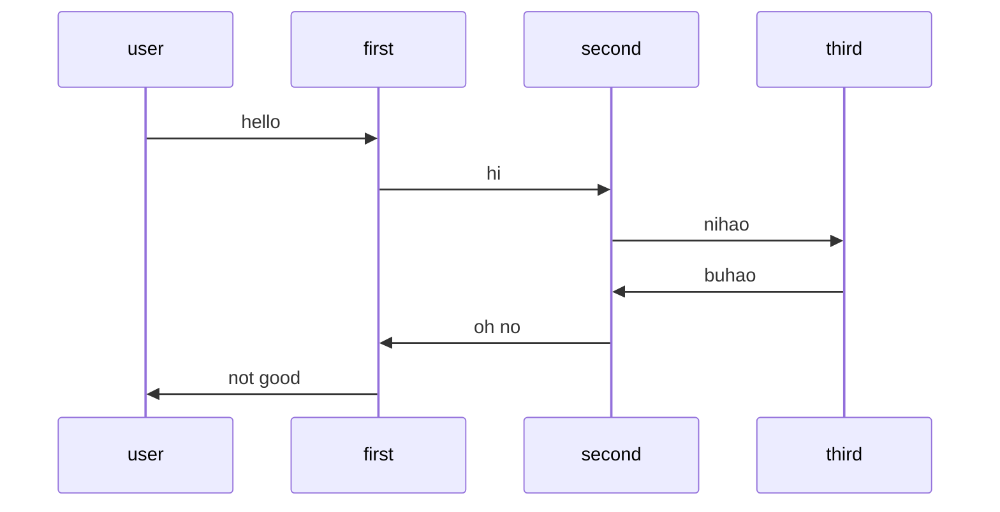

# 两个相对的参考系

在开发和交流过程中发现一些相对的词语, 比如"上下游", "滑动方向". 我和他人的的理解是不一致的. 在这里特别记录一下.

## 上下游

我对web的上下游服务是从用户开始的, 用户发起是上游. 而同事和网上给出是用户是下游. 当然这里我经过思考可能是我是错误的.

我产生这个理解的重要原因是"时序图", 简单的时序图就是一个折线图, 从用户到第一, 第二, 第三系统, 然后在返回, 这明显是存在上下游的关系, 用户是明显的上游, 而服务是下游, 越靠近数据库, 越是下游. 从这个流程上看数据是从用户发出又流会了用户, 当最终决定上下游关系, 取决于如何定义哪里是开始.

上下游最开始来源于河流这种地理现象, 上游的水流到下游, 跟一般的讲 "上游河道一般海拔高于下游河道", 这里逻辑是简单而直观的, 无序过多解释. 之后上下游进入了个工厂和供应链中, 依旧是相似的, 上游的产出会被下游接受, 并一直传递下去.

> 在参考文献中, 作者总结出一下两个原则:
> * 依赖原则：从自身的角度看，每个环节都依赖其上游的环节.
> * 价值原则：往下游移动，每一环节都在产品上增加了价值. 在微服务中"离用户（或者其他终端客户）越近的服务，它就越下游。"

其实我个人更倾向于依赖原则, 上游不会收到下游影响. 用自然现象举例, 上游水多了, 下游只能决堤(泛滥), 下游只能忍着没有别的办法. 在我例子中, 其实用户只能被系统摆布, 所以人是处于下游的.

我个人认为"上下游"在软件领域是一个很不好的词, 软件领域会稍不注意就会出现循环依赖, 相互作用, 极端点还有递归行为. 其实更好的词还是依赖与被依赖, 这是一个简单而明确的词语组合.

### 参考
* [What is Upstream and Downstream in Software Development?](https://reflectoring.io/upstream-downstream/)
* [译 软件开发中的上游和下游是什么？](http://echolihao.github.io/posts/%E7%BF%BB%E8%AF%91-%E8%BD%AF%E4%BB%B6%E5%BC%80%E5%8F%91%E4%B8%AD%E7%9A%84%E4%B8%8A%E6%B8%B8%E5%92%8C%E4%B8%8B%E6%B8%B8%E6%98%AF%E4%BB%80%E4%B9%88.html)

## 滑动

计算机(手机)界面的核心操作之一就是"滑动", 通过滑动来展示更多的内容. 这里就涉及道一个向上和想下之间的区别.

两中操作具体效果
* A操作: 屏幕中内容想上滚动(存在滚动条情况, 滚动条向下移动)
* B操作: 屏幕中内容想下滚动(存在滚动条情况, 滚动条向上移动)

这个滑动在mac和windows两个平台就是相反的(默认情况)
* mac默认是手指想上滑动实现"A操作", 这种操作和手机屏幕逻辑相同, 既手指想上滑动, 可以理解为把什么东西从不可见的地方拽上来; 或者说是以窗口为静止参考系, 内容在向上移动;
* windows正好相反, 手指向下滑动实现"A操作", 可以理解为拖动滚动条的逻辑; 或者说是内容为静止参考系, 是窗口在想下移动.

我已经忘了windowsphone和Nokia关于滑动的操作是什么效果了, 这两个系统滑动就有可能会和现在主流就会不一致. 但我在手机和pc之间的操作习惯是反的.

## 最后

这种名词很多时候会因为人所处的位置, 参考系会发生变化, 这种相对的词汇含义可以立刻反转. 就像汉语中的"借"这个字, 可以轻松的将债权人和债务人进行反正的一个字, 必须加更多的词进行限制来区分.

在程序开发和设计中尽量减少这种模糊性的词语, 对非程序员或未达成共识的团队中存在巨大问题.

