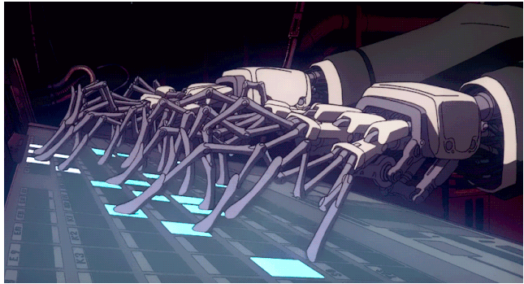

# 安全的数据copy

刷知乎的时候发现一个牛逼的病毒叫"[震网](https://zh.wikipedia.org/zh-hans/%E9%9C%87%E7%BD%91)". 从最后的结果看病毒成功了, 有效的阻止了伊朗的核计划. 让我我突然想到了一个问题"电脑上的文件如何安全的copy到另一台电脑?", 设置一个前提条件"进行数据copy的人是安全的". 然后我的结论就是没有什么方法是安全的.

直接U盘, 那远电脑可能有病毒然后通过U盘就有效的传播了. 

通过网络, 这本身就是一个重灾区, 更加困难.

光盘, 光盘本身的刻录机器是否是安全的呢? 可能并不安全. 所以也有问题. 

最后结论是只要这个copy链路上有一台直接接入到过互联网, 那整个系统就不是安全的. 想到这里我突然想到了一个经典的动画中的一幕, 出自攻壳机动队  

这张图片的前后剧情是这样的, 一个能力很强的人工智能程序本体被束缚在人偶中, 现在需要进行对话, 而沟通之前需要一定的程序辅助\(我的理解\). 而这个过程并没有选择使用数据线, 在攻壳机动队中数据线进行控制很常见, 这里选择了手动输入输入, 所有有了这个很帅的界面. 十个手指变为几十个, 然后进行输入. 选择了一种最慢的方式, 但可能是最安全的. 当然这里的安全是双向的, 保证没有病毒进入人偶中, 也要保证不被人偶侵入.

这可能就是最安全的数据复制方式, 通过键盘这种输入终端再来一遍. 这里只要保证输入人是安全的就不会有大问题, 剩下的就是各种review了. 只有这样保证了电脑完全没有接入过互联网, 有效的防止了病毒的传输.

